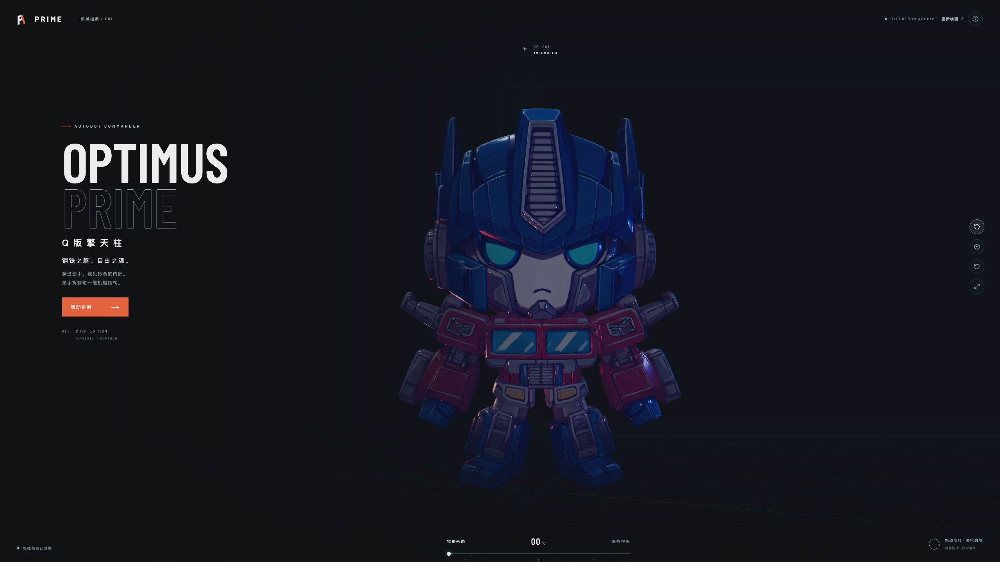

# Q版擎天柱 · Optimus Prime 3D Showcase

一个基于 React、Vite、Three.js 和 React Three Fiber 制作的 Q 版擎天柱 3D 展示页。
页面参考机械档案与产品拆解展示风格，支持完整形态、8 部件对称爆炸视图、结构索引高亮以及角色资料介绍。



## 功能特性

- Q 版擎天柱 3D 模型展示
- Hyper3D Rodin 生成模型资源接入
- 8 个独立机械部件的对称爆炸动画
- 完整形态与爆炸视图之间的平滑过渡
- 结构索引点击高亮对应部件
- 自动旋转、手动拖动旋转和滚轮缩放
- 线框模式、重置视角和全屏展示
- 机械档案风格的角色资料弹窗
- 响应式布局，支持桌面端和移动端

## 技术栈

- React 18
- Vite 6
- Three.js
- React Three Fiber
- Drei
- Lucide React

## 本地运行

### 环境要求

- Node.js 18 或更高版本
- npm

### 安装依赖

```bash
npm install
```

### 启动开发服务器

```bash
npm run dev
```

默认情况下，Vite 会在终端显示本地访问地址。也可以使用以下地址访问当前项目：

```text
http://127.0.0.1:5175/
```

### 构建生产版本

```bash
npm run build
```

### 预览生产构建

```bash
npm run preview
```

## 交互说明

- 点击“启动拆解”或“爆炸视图”，查看 8 个部件逐步展开
- 拖动模型进行旋转
- 使用鼠标滚轮缩放模型
- 点击右侧“结构索引”，聚焦并高亮对应部件
- 拖动底部进度条，查看不同拆解阶段
- 点击自动旋转按钮，切换模型自动旋转
- 点击线框按钮，切换线框展示模式
- 点击右上角 `Info` 按钮，打开擎天柱角色档案

## 项目结构

```text
.
├── public/
│   ├── optimus-bang.glb   # 当前使用的 8 部件爆炸模型
│   ├── optimus.glb        # 备用模型资源
│   └── hyper-mecha.glb    # 备用机械模型资源
├── src/
│   ├── main.jsx           # React 应用、3D 场景和交互逻辑
│   └── styles.css         # 页面布局、档案 UI 和响应式样式
├── skill/
│   ├── hyper3d-model-landing-page/     # 图片 → Hyper3D HTTP API → 3D → 展示页
│   └── hyper3d-mcp-model-landing-page/ # 图片 → Hyper3D MCP → 3D → 展示页
├── index.html
├── package.json
└── README.md
```

## Hyper3D 工作流 Skill

完整工作流维护在 `skill/hyper3d-model-landing-page/`，现在拆分为两个独立脚本：

- `generate_reference_image.py`：使用 OpenAI 生图 API 生成参考图
- `generate_hyper3d_model.py`：使用本地图片或图片 URL 调用 Hyper3D 生成 3D 文件

安装 Python 依赖并查看命令帮助：

```bash
python3 -m pip install -r skill/hyper3d-model-landing-page/requirements.txt
python3 skill/hyper3d-model-landing-page/scripts/generate_reference_image.py --help
python3 skill/hyper3d-model-landing-page/scripts/generate_hyper3d_model.py --help
```

使用 OpenAI 生图脚本前配置 `OPENAI_API_KEY`，使用 Hyper3D 模型脚本前配置 `HYPER3D_API_KEY`。模型脚本会生成 GLB 文件、可选的 BANG 爆炸模型，并可通过 `--project-dir` 将最终模型复制到前端项目的 `public/` 目录；落地页接入与视觉实现规范见该 Skill 的 `SKILL.md`。

如果使用 Hyper3D MCP 版本，请使用 `skill/hyper3d-mcp-model-landing-page/SKILL.md`：图片参考图仍可由同目录的 `generate_reference_image.py` 生成，但 3D 模型必须通过 `rodin_create_uploads`、`rodin_generate`、`rodin_wait`、`rodin_get_result` 以及可选的 `rodin_generate_bang` MCP 工具完成。

如果当前客户端没有安装 Hyper3D MCP，MCP 版 Skill 会先提示配置 `hyper3d` 服务、使用 OAuth 授权，并在浏览器授权后验证连接和可用工具；不会自动切换到 HTTP API 版本。

## 模型说明

当前页面使用 `public/optimus-bang.glb` 作为展示模型，并将模型中的 8 个节点映射为头部、双肩臂、双胸甲、核心躯干和双腿脚部。
模型通过 Hyper3D Rodin 生成并用于本项目的 AI 视觉研究展示；页面中的 Q 版造型不代表官方模型，也不还原真实变形机构。

## 角色资料来源

展示页中的擎天柱角色介绍参考以下公开资料：

- [Hasbro Transformers 官方站](https://transformers.hasbro.com/)
- [Optimus Prime 角色概览](https://en.wikipedia.org/wiki/Optimus_Prime)

不同动画、漫画和电影版本可能存在不同的角色设定，页面内容以通用角色形象介绍为主。

## 许可说明

本项目为 3D 交互展示实验项目。使用或分发模型资源、字体及第三方内容时，请确认对应的版权和授权范围。
